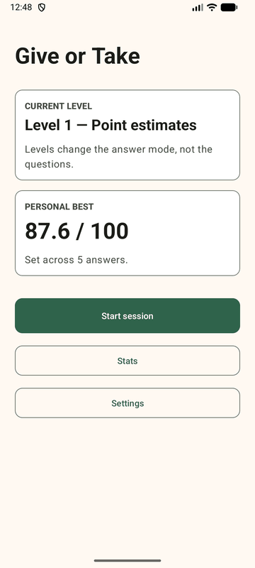
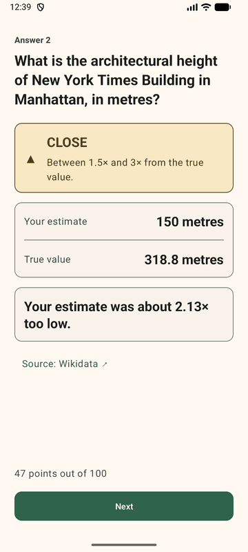
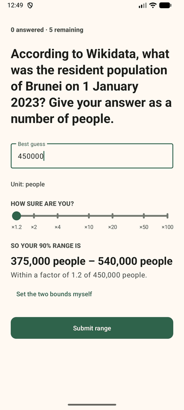
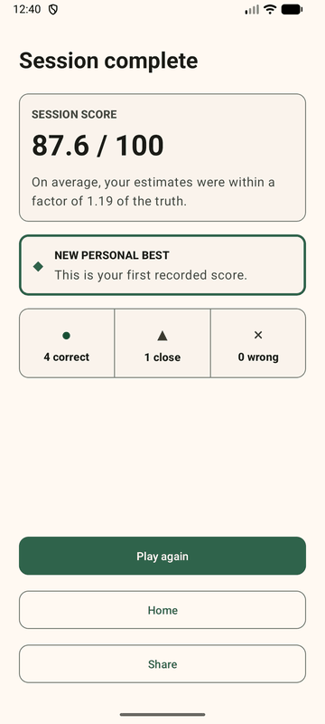
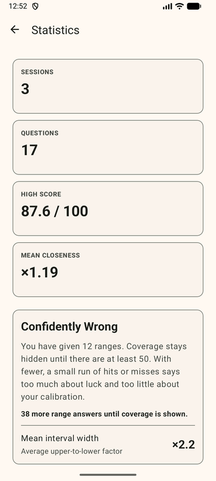
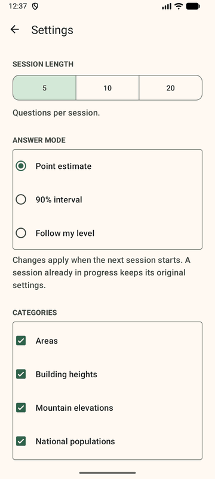

# Give or Take

An Android quiz app for practising numerical estimation and checking whether confidence ranges are as reliable as they claim to be.

[](https://github.com/chrkorn/give-or-take/actions/workflows/ci.yml)

## What it does

Give or Take asks questions whose answers are quantities, such as “How long is the River Thames?”. In standard mode, the player submits one number. The score reflects how close that estimate is to the true value. It uses log-relative error, `|log10(guess / truth)|`, so an estimate that is too large by a given factor is treated like one that is too small by the same factor.

Interval mode asks for a lower and upper bound intended to contain the true answer with 90% confidence. Across multiple sessions, the app compares that stated confidence with the proportion of ranges that actually contained the truth. Unlike a normal quiz app, it does not reduce every answer to correct or incorrect: it measures estimation error continuously and makes systematic overconfidence or underconfidence visible.

## Screenshots

<table>
  <tr>
    <td align="center"><br><sub>Home</sub></td>
    <td align="center"><br><sub>Point estimate</sub></td>
    <td align="center"><br><sub>Feedback</sub></td>
    <td align="center"><br><sub>90% interval</sub></td>
  </tr>
  <tr>
    <td align="center"><br><sub>Session result</sub></td>
    <td align="center"><br><sub>Statistics</sub></td>
    <td align="center"><br><sub>Settings</sub></td>
    <td></td>
  </tr>
</table>

Captured on an Android emulator (1080 × 2400) and scaled to a third of their size.

## Building and running

To build and run the app you need:

- Android Studio Quail 4 (2026.1.4) or later
- Android SDK Platform 37, with the SDK location made available to Gradle (see below)
- An emulator or Android device running API level 26 or later

You do not need to install a JDK separately, but the Gradle wrapper needs a Java runtime to
start. Android Studio ships one, and Android Studio's own builds use it automatically. For the
command-line builds below, point `JAVA_HOME` at it first:

```shell
# macOS
export JAVA_HOME="/Applications/Android Studio.app/Contents/jbr/Contents/Home"
# Linux (adjust to where Android Studio is installed)
export JAVA_HOME="/opt/android-studio/jbr"
```

On Windows, set `JAVA_HOME` to `C:\Program Files\Android\Android Studio\jbr`. Without a Java
runtime, `./gradlew` stops immediately with "Unable to locate a Java Runtime" (macOS) or
"JAVA_HOME is not set" (Linux, Windows). Any existing JDK 17 or newer works as well.

Once started, the build pins its own toolchain for the Gradle daemon (Adoptium 17, declared in
`gradle/gradle-daemon-jvm.properties`) and downloads it on first run if it is missing. The
application source is compiled against Java 11. The Gradle wrapper is committed, so no separate
Gradle installation is needed.

Clone the repository and enter its directory:

```shell
git clone https://github.com/chrkorn/give-or-take.git
cd give-or-take
```

### Pointing the build at your Android SDK

Gradle needs to know where your Android SDK lives. The file that normally
carries this, `local.properties`, is machine-specific and deliberately not
committed, so a fresh clone does not have one. Choose either option:

- **Open the project in Android Studio first.** Select *Open*, choose the
  cloned `give-or-take` directory, and let the Gradle sync finish. Android
  Studio writes `local.properties` for you, after which the commands below
  work in a terminal.
- **Or set the location yourself**, from the repository root:

  ```shell
  export ANDROID_HOME=/path/to/your/Android/sdk
  ```

  On macOS the default path is `~/Library/Android/sdk`; on Linux it is
  `~/Android/Sdk`. Alternatively, create a `local.properties` file in the
  repository root containing `sdk.dir=/path/to/your/Android/sdk`.

Without one of these, the build stops with `SDK location not found`.

### Building

Build a debug APK and run the local unit tests:

```shell
./gradlew assembleDebug
./gradlew test
```

The APK is written to `app/build/outputs/apk/debug/app-debug.apk`.

To run the app in Android Studio, open the cloned `give-or-take` directory and wait for the Gradle sync to finish. Open **Tools > Device Manager**, create and start a virtual device with API level 26 or newer, select the `app` run configuration, and click **Run**. Android Studio will build, install, and launch the app on the selected emulator.

## Running the tests

Local unit tests use JUnit 4 and run on the JVM without a device. Most cover the plain Java `core`
package; Activities, views and the SQLite layer are exercised with Robolectric
([ADR 0023](docs/adr/0023-test-android-components-on-the-jvm-with-robolectric.md)). Run all of them from the
repository root:

```shell
./gradlew test
```

Instrumented tests use Espresso and run inside Android. **They need a device or emulator running
API level 35 or lower.** The pinned Espresso 3.5.1 relies on a hidden platform method that API 36
and later no longer provide, so every Espresso interaction fails there; the app itself runs on any
API level from 26 upwards. In Device Manager, create a virtual device with an API 35 system image,
start it, confirm that it appears in Android Studio, then run:

```shell
./gradlew connectedDebugAndroidTest
```

Alternatively, `tools/run_instrumented_tests.sh` locates the SDK, checks that a suitable emulator is
running (starting one if needed), refuses devices above API 35, and runs the suite:

```shell
tools/run_instrumented_tests.sh
```

In Android Studio, individual tests can also be run from the gutter beside a test class or method. Unit tests live under `app/src/test/`; instrumented tests live under `app/src/androidTest/`.

## Project structure

Application code lives below `app/src/main/java/de/christiankorn/giveortake/`:

```text
de/christiankorn/giveortake/
├── (root)  Activities (home, quiz, feedback, result, statistics, settings), input validation,
│           and small presentation helpers
├── core/   scoring, correctness bands, calibration, questions, sessions and training rules
├── data/   question-bank loading, SQLite history, statistics queries and preferences
└── ui/     custom views: the uncertainty dial and the calibration chart
```

The `core` package is plain Java and must not import `android.*`. Keeping the rules independent of
the Android framework makes them fast to run and straightforward to test with ordinary JUnit tests.
Android-specific screen and persistence code stays in the other packages.

Other directories:

- `app/src/main/assets/questions.json`: the bundled question bank
- `app/src/test/` and `app/src/androidTest/`: JVM and instrumented tests
- `docs/adr/`: architecture decision records; `docs/devlog.md`: dated development log
- `tools/`: question-bank generator, magnitude-coverage check and the instrumented-test runner

## Design decisions

Each significant decision is recorded as an ADR in [`docs/adr/`](docs/adr/):

- **Platform and structure:**
  [0001 Java with XML layouts](docs/adr/0001-language-and-ui-toolkit.md),
  [0015 `findViewById`](docs/adr/0015-use-findviewbyid-for-view-access.md),
  [0022 settings with ordinary controls](docs/adr/0022-build-settings-with-ordinary-activity-controls.md)
- **Questions:**
  [0002 value domain and identity](docs/adr/0002-question-value-domain-and-identity.md),
  [0010 versioned banks with Gson](docs/adr/0010-load-versioned-question-banks-with-gson.md),
  [0011 Wikidata as source](docs/adr/0011-source-question-data-from-wikidata.md),
  [0012 composed prompts](docs/adr/0012-store-composed-question-prompts.md),
  [0013 magnitude coverage](docs/adr/0013-require-overlapping-magnitude-coverage.md)
- **Scoring:**
  [0003 point and interval guesses](docs/adr/0003-represent-guesses-as-separate-types.md),
  [0004 log-relative error](docs/adr/0004-use-log-relative-error-for-point-estimates.md),
  [0005 exponential points](docs/adr/0005-map-log-relative-error-to-points.md),
  [0006 correctness bands](docs/adr/0006-classify-estimates-with-correctness-bands.md),
  [0007 interval score](docs/adr/0007-score-confidence-intervals-with-log-interval-score.md)
- **Training:**
  [0008 delayed repeats](docs/adr/0008-delay-wrong-question-repeats-within-session.md),
  [0009 levels and session scores](docs/adr/0009-use-curriculum-levels-and-mean-session-scores.md),
  [0014 best guess and uncertainty factor](docs/adr/0014-use-best-guess-and-uncertainty-factor-for-range-input.md),
  [0018 repeating missed intervals](docs/adr/0018-repeat-missed-confidence-intervals.md)
- **State and persistence:**
  [0016 session in instance state](docs/adr/0016-save-active-session-in-instance-state.md),
  [0017 results as Intent extras](docs/adr/0017-pass-completed-results-as-primitive-intent-extras.md),
  [0019 SQLite sessions](docs/adr/0019-persist-raw-answer-history-in-sqlite.md),
  [0020 serial database executor](docs/adr/0020-serialize-database-io-on-application-executor.md),
  [0021 statistics from core policies](docs/adr/0021-derive-statistics-with-core-policies.md),
  [0024 known durability gaps](docs/adr/0024-accept-two-history-durability-gaps.md)
- **Testing:**
  [0023 Robolectric](docs/adr/0023-test-android-components-on-the-jvm-with-robolectric.md),
  [0025 deterministic session inputs](docs/adr/0025-inject-session-inputs-for-deterministic-ui-tests.md)

## Question data

The bundled bank holds 80 questions in four categories: 30 national populations, 30 areas,
10 mountain elevations and 10 building heights. It was generated on 12 September 2026 from
[Wikidata](https://www.wikidata.org/) and then curated by hand. The generation date, source dataset,
generator version and licence are recorded in the metadata of
[`questions.json`](app/src/main/assets/questions.json).

- Population, elevation and building questions cite Wikidata. Each question links to the immutable
  revision of the Wikidata item it was generated from.
- Area questions cite the publication that the Wikidata statement itself references, for example
  a national statistics office or mapping agency. Wikidata served to find the value, and the
  question links to that primary source. The app uses only the number and the link; no text from
  these publications is reproduced.

[`tools/README.md`](tools/README.md) documents extraction, the admission rules, prompt overrides and
the manual-curation step. [ADR 0011](docs/adr/0011-source-question-data-from-wikidata.md) records
why Wikidata was chosen and how the sourcing policy was tightened after an external review.

Wikidata's structured data are made available under the
[CC0 1.0 Universal public-domain dedication](https://creativecommons.org/publicdomain/zero/1.0/).
Attribution is included for provenance and academic traceability, not because CC0 requires it.
Neither Wikidata nor the Wikimedia Foundation endorses Give or Take.

## Licence

Released under the MIT Licence. You may use, copy, modify, merge, publish,
distribute, sublicense, and sell copies of this software, for any purpose,
including commercially, provided the copyright notice and permission notice
are retained. The software comes with no warranty. See [LICENSE](LICENSE) for
the full text.

This covers the source code in this repository. Any question data shipped with
the app carries its own licence, recorded in the section above.
